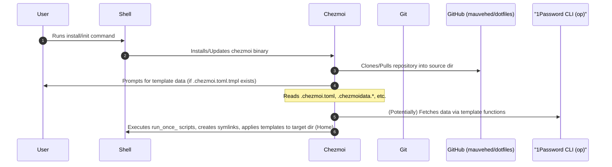
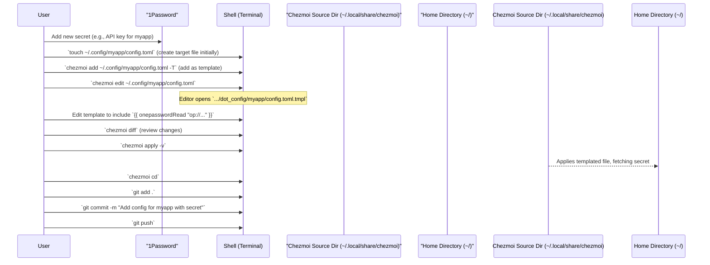

# Chezmoi Usage: In-Depth Guide

This document provides a comprehensive guide to using `chezmoi` for managing your dotfiles, expanding on the information in the main `README.md`.

## Overview

[Chezmoi](https://www.chezmoi.io/) (pronounced _/ʃeɪ mwa/ - shay moi) is a powerful, flexible, and secure dotfiles manager. It helps you manage your configuration files (dotfiles) across multiple machines with ease.

Key features leveraged in this setup include:
*   **Templating**: Using Go templates (with Sprig functions and custom data) to make dotfiles dynamic.
*   **Secret Management**: Integration with 1Password CLI to securely handle sensitive data.
*   **OS-Specific Configuration**: Applying different configurations based on the operating system.
*   **Script Execution**: Running scripts at various points in `chezmoi`'s lifecycle (`run_once_`, `run_onchange_`, etc.).
*   **External File Management**: Managing files and archives from external sources.

## Core Concepts

*   **Source Directory**: Where `chezmoi` stores your dotfiles and configurations (typically `~/.local/share/chezmoi`). This directory is a Git repository.
*   **Target Directory**: Your home directory (`~`) where `chezmoi` applies the configurations.
*   **Configuration File**: `~/.config/chezmoi/chezmoi.toml` (or `.yaml`/`.json`) stores `chezmoi`'s own configuration, including data accessible in templates.

## Installation and Initialization

As covered in the main `README.md`, initialization typically involves:

```sh
sh -c "$(curl -fsSL get.chezmoi.io)" -- init --apply mauvehed
```
This command:
1.  Downloads and installs `chezmoi` if not present.
2.  Clones your dotfiles repository (github.com/mauvehed/dotfiles) into `~/.local/share/chezmoi`.
3.  Prompts for any initial configuration data defined in `.chezmoi.toml.tmpl`.
4.  Applies the dotfiles to your home directory.

### Initial Setup Flow (Conceptual)


*(This diagram is a simplification of the actual process)*

## Common `chezmoi` Commands

*   **`chezmoi add <path_to_file_in_home>`**: Adds a file from your home directory to `chezmoi`'s source directory.
    *   Example: `chezmoi add ~/.gitconfig`
    *   Use the `-T` or `--template` flag to add it as a template: `chezmoi add ~/.gitconfig --template`
    *   Use the `-e` or `--encrypt` flag to add it as an encrypted file (less common now with 1Password integration for secrets).

*   **`chezmoi edit <path_to_file_in_home>`**: Opens a file managed by `chezmoi` in your `$EDITOR` by operating on the source file.
    *   Example: `chezmoi edit ~/.gitconfig`

*   **`chezmoi apply [-v --dry-run]`**: Applies changes from the source directory to the target directory.
    *   `-v` / `--verbose`: Shows what changes are being made.
    *   `--dry-run`: Shows what would be changed without actually making changes.
    *   `--init`: Re-runs initialization steps (useful if `.chezmoi.toml.tmpl` changes).
    *   `-R` / `--refresh-externals`: Forces a refresh of externally managed files.

*   **`chezmoi update`**: Pulls changes from your Git remote, then applies changes.
    *   Equivalent to `chezmoi git pull && chezmoi apply` (simplified).

*   **`chezmoi diff`**: Shows the differences between the target state in your home directory and the state defined by your source directory and templates.

*   **`chezmoi forget <path_to_file_in_home>`**: Removes a file from `chezmoi` management (it will no longer be updated by `chezmoi apply`). The file in your home directory is not deleted by this command.

*   **`chezmoi remove <path_to_file_in_home>`**: Removes a file from `chezmoi` management AND deletes it from the source directory. The file in your home directory is not deleted by this command.

*   **`chezmoi chattr <attributes> <target>`**: Changes attributes of a target in the source directory (e.g., `private`, `readonly`, `template`, `executable`, `empty`).
    *   Example: `chezmoi chattr template ~/.gitconfig` (makes it a template)
    *   Example: `chezmoi chattr private ~/.ssh/config` (marks it as private)

*   **`chezmoi doctor`**: Checks for common problems with your setup.

*   **`chezmoi cd`**: Opens a new shell in the source directory (`~/.local/share/chezmoi`).

*   **`chezmoi data`**: Prints the data available to templates (merges data from various sources). Useful for debugging templates.
    *   Example: `chezmoi data | jq` (if `jq` is installed)

*   **`chezmoi execute-template <template_string_or_file>`**: Executes a Go template. Useful for testing template snippets.
    *   Example (1Password): `chezmoi execute-template '{{ (onepasswordRead "op://Personal/API_KEY_MYAPP/password").stdout | trim }}'`
    *   Example (OS specific): `chezmoi execute-template '{{ if eq .chezmoi.os "darwin" }}macOS Specific Value{{ else }}Other OS Value{{ end }}'`

*   **`chezmoi git <git_args...>`**: Runs Git commands in the source directory.
    *   Example: `chezmoi git status`, `chezmoi git push`

## Templating

`chezmoi` uses Go's [text/template](https://pkg.go.dev/text/template) package. This allows for dynamic configuration files.

*   **Syntax**: Templates are enclosed in `{{ }}`.
*   **Sprig Functions**: Over 100 helpful [Sprig functions](http://masterminds.github.io/sprig/) are available (e.g., string manipulation, math, data structures).
*   **`chezmoi` Specific Data**: `chezmoi` provides variables like `.chezmoi.os`, `.chezmoi.hostname`, etc. See `chezmoi data`.
*   **Custom Data**: Data from `.chezmoi.toml` or data files (e.g., `.chezmoidata.yaml`) is available.
*   **1Password Integration**: Use functions like `onepassword`, `onepasswordRead`, `onepasswordDocument` to fetch secrets from 1Password. See `docs/1password-usage.md` for details.
    ```toml
    # Example in a .gitconfig.tmpl
    [user]
        email = {{ .email | quote }}
        signingkey = {{ (onepasswordRead "op://Personal/Git Keys/signingkey_id").stdout | trim | quote }}
    ```

## Scripts

`chezmoi` can execute scripts at different points:

*   **`run_once_*.sh`** (or other extensions): Executed only once per machine. Useful for initial setup tasks (e.g., installing Homebrew).
*   **`run_onchange_*.sh`**: Executed if their content (or the content of files they depend on via comments) changes. Useful for tasks that need to re-run if a related config file changes.
*   **`run_before_*.sh`**: Run before `chezmoi apply` applies changes for that script's directory.
*   **`run_after_*.sh`**: Run after `chezmoi apply` applies changes for that script's directory.

Scripts must be executable. `chezmoi` adds template functions to the script's environment as environment variables.

## Managing External Files (`.chezmoiexternal.toml`)

`chezmoi` can manage files and archives from external sources (URLs) using a `.chezmoiexternal.toml` file in the source directory.

*   **Use Cases**: Downloading a specific version of a tool, fetching a `Brewfile` from a gist, managing `oh-my-zsh` installation/updates.
*   **Format**: TOML file defining targets and sources.
*   **Refresh**: Use `chezmoi apply -R` or `chezmoi apply --refresh-externals` to force download/update.

Example `.chezmoiexternal.toml` entry:
```toml
# ["{{ .chezmoi.sourceDir }}/path/to/oh-my-zsh.sh"]
#   type = "file"
#   url = "https://raw.github.com/ohmyzsh/ohmyzsh/master/tools/install.sh"
#   refreshPeriod = "168h" # Refresh once a week
```

## Managing Dotfile Attributes

`chezmoi` allows setting attributes for files and directories in the source directory, influencing how they are treated:

*   **`private_` prefix**: The target file will have permissions `0600` (or `0700` for directories).
*   **`readonly_` prefix**: The target file will be read-only.
*   **`executable_` prefix**: The target file will be executable.
*   **`empty_` prefix**: The target file will be created empty if it does not exist.
*   **`.tmpl` suffix**: The file is treated as a Go template.
*   **`.encrypted` suffix**: The file is encrypted using GPG (less common with 1Password integration).

These can also be managed with `chezmoi chattr`.

## Troubleshooting

*   **`chezmoi doctor`**: Run this first to check for common issues.
*   **`chezmoi -v apply --dry-run`**: Verbose dry run to see what `chezmoi` *thinks* it should do.
*   **`chezmoi data`**: Inspect the data available to your templates.
*   **Check Permissions**: Ensure scripts are executable, and `chezmoi` has rights to write to target locations.
*   **Template Errors**: `chezmoi execute-template` is invaluable for debugging specific template snippets.

## Advanced Usage Flow (Adding a new templated file with a secret)



## Resources

*   **Official `chezmoi` Website**: [https://www.chezmoi.io/](https://www.chezmoi.io/)
*   **`chezmoi` User Guide**: [https://www.chezmoi.io/user-guide/](https://www.chezmoi.io/user-guide/)
*   **`chezmoi` Reference**: [https://www.chezmoi.io/reference/](https://www.chezmoi.io/reference/)
*   **`docs/1password-usage.md`**: For details on 1Password integration.

This guide should provide a solid foundation for working with `chezmoi` in this dotfiles setup. Refer to the official `chezmoi` documentation for the most detailed and up-to-date information.
